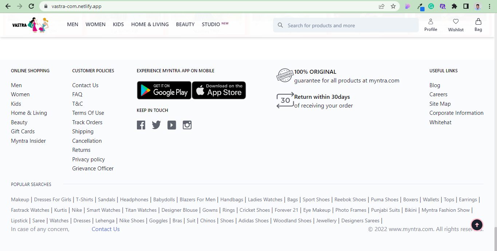
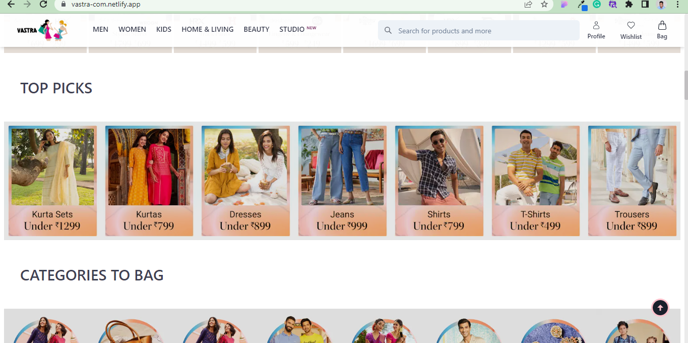
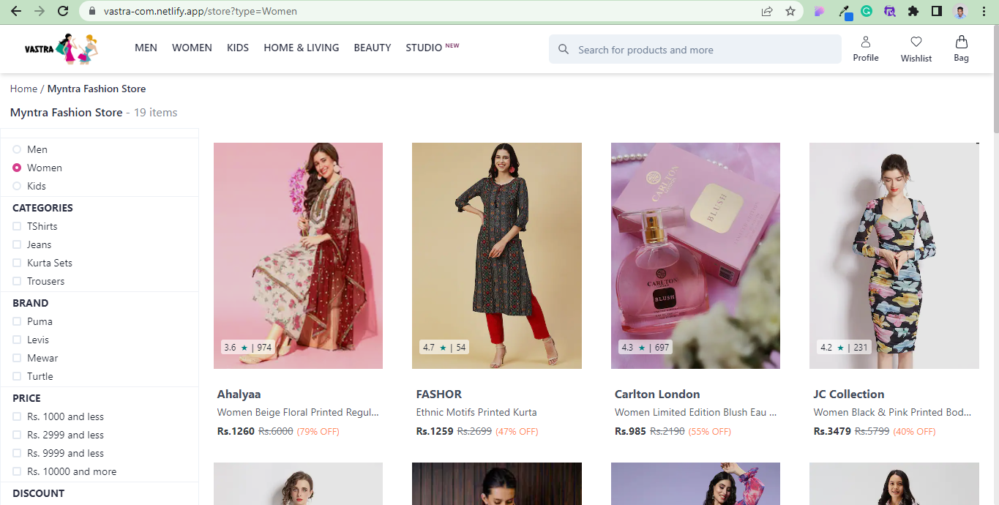
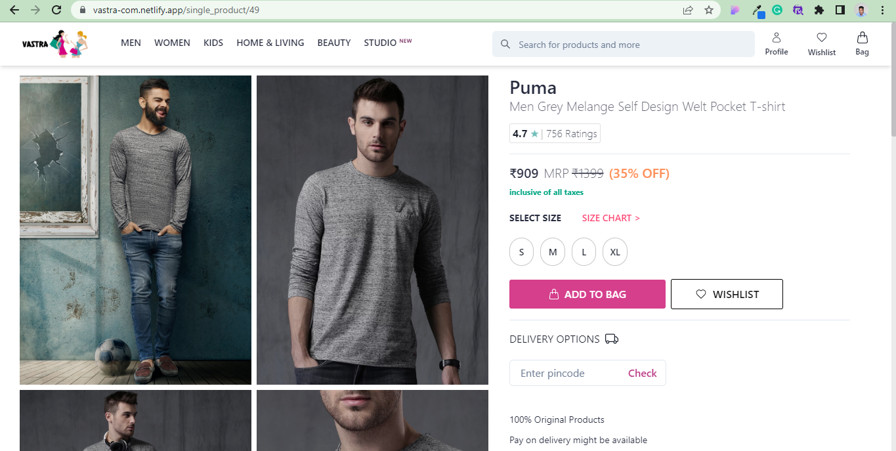
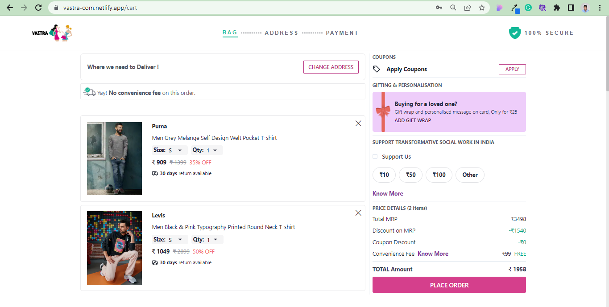
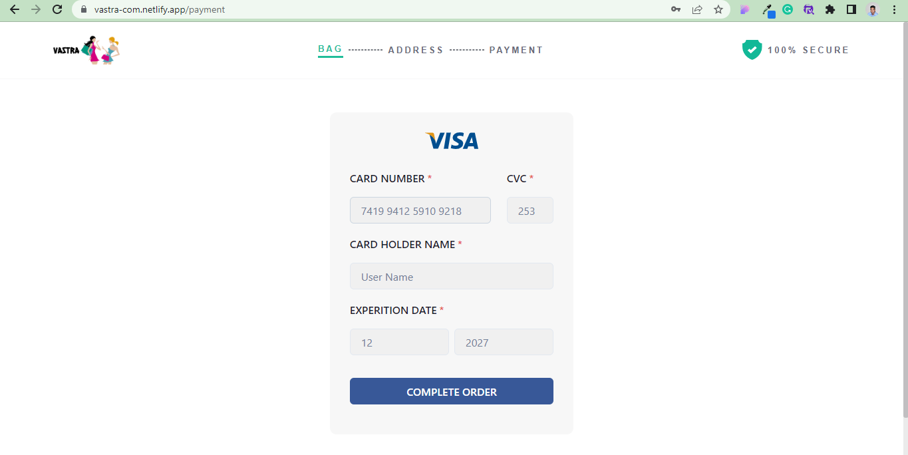

# Myntra.com-Clone
## [Deployed URL](https://vastra-com.netlify.app/)
## Fashion Store

-Ecommerce Website
Vastra.com is a Casual Wear and Lifestyle Brand and E-commerce platform. 
Vastra is a one stop shop for all your fashion and lifestyle needs. Being India's largest e-commerce store for fashion and lifestyle products, Myntra aims at providing a hassle free and enjoyable shopping experience to shoppers across the country with the widest range of brands and products on its portal. The brand is making a conscious effort to bring the power of fashion to shoppers with an array of the latest and trendiest products available in the country.

---

## Technologies used

- React
- Redux
- Html
- CSS
- Javascript
- Chakra UI
- React Icons

## Installing and Running

To run this application on your local system

- Clone the Repository
- Install npm packages
- Run the application

## Features

---

- There is login and logout functionality.
- Elegant navbar for easy navigation between pages and categories.
- Product Pages where all the products are displayed using Api.
- Single Product Page on clicking Each Product carrying description of that product.
- Cart with Crud Operations.
- Payment Pages.
- Footer for navigating to different social Media Pages.

## Steps to navigate the website:

- On opening the application the user is taken to the landing Page which have a Navbar to navigate to different Section of the application.
- On the Landing Page Navbar, user can click on Website Logo in Navbar to navigate to categories where all the categories of the products available are displayed.
- There are three categories available Men/Women/Kids.
- Product Pages containing all the Products available with options of sort and filter according to users requirements.
- Single Product Page to view the description of each and every Product.
- Cart Page with of add/delete the product.
- Payment Pages with form validation.

---

### Home Page and Footer

  

  
---

### Categories

---

### Products Section

### Login Page/Signup Page

## 

---
### Cart Section

---
### Payment Section

##  Contributors (Individual)

1. [Govind Kumawat](https://github.com/gk072745)
